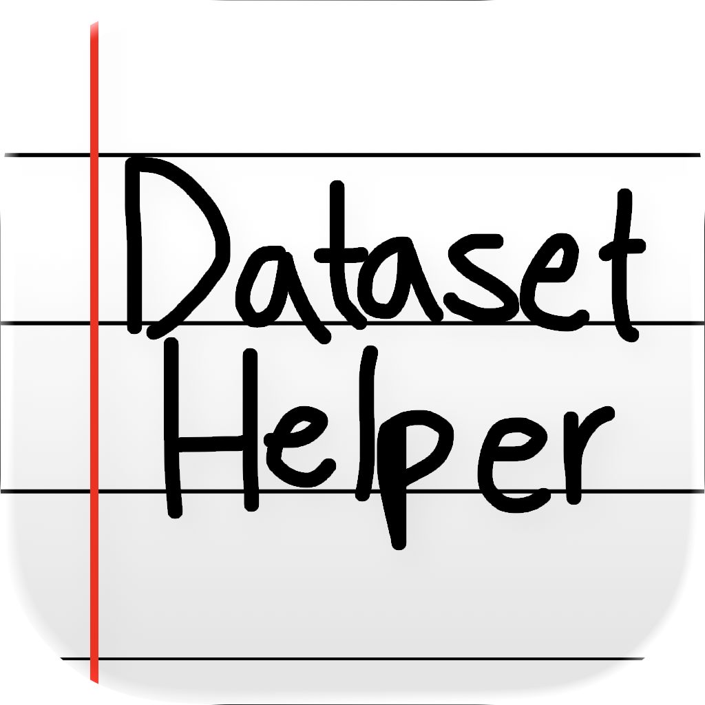
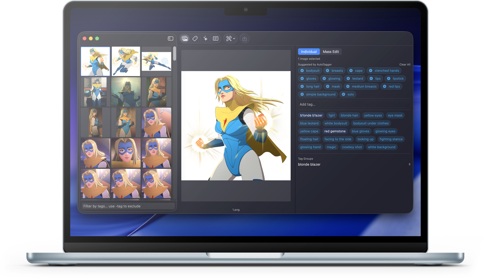
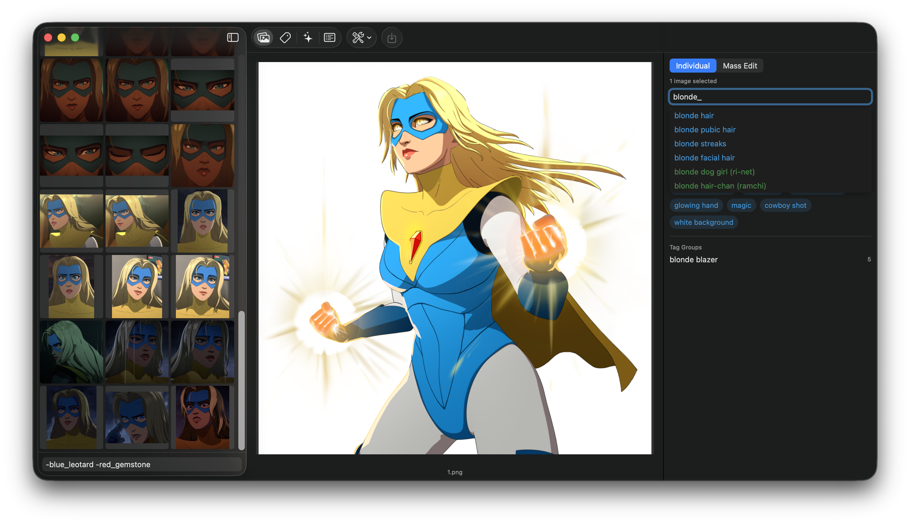
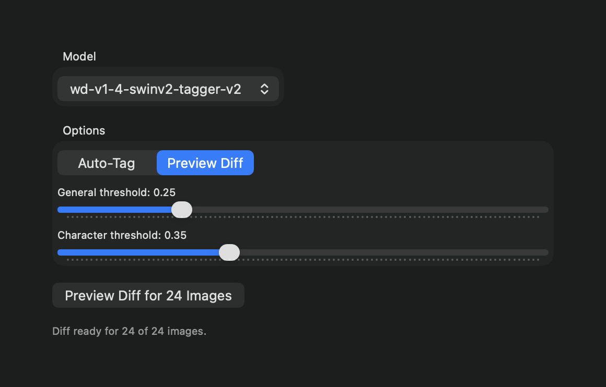
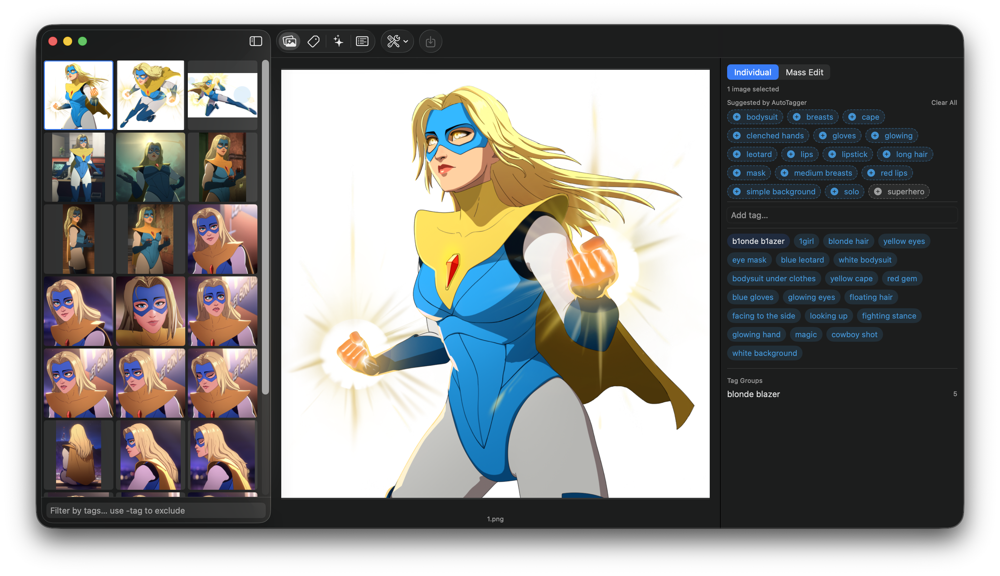
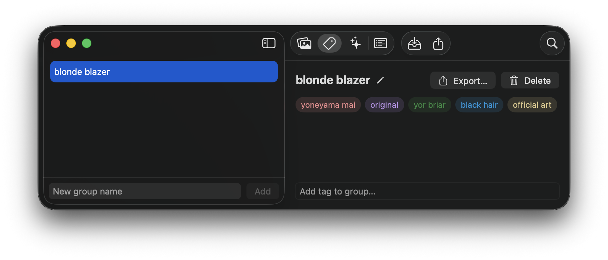
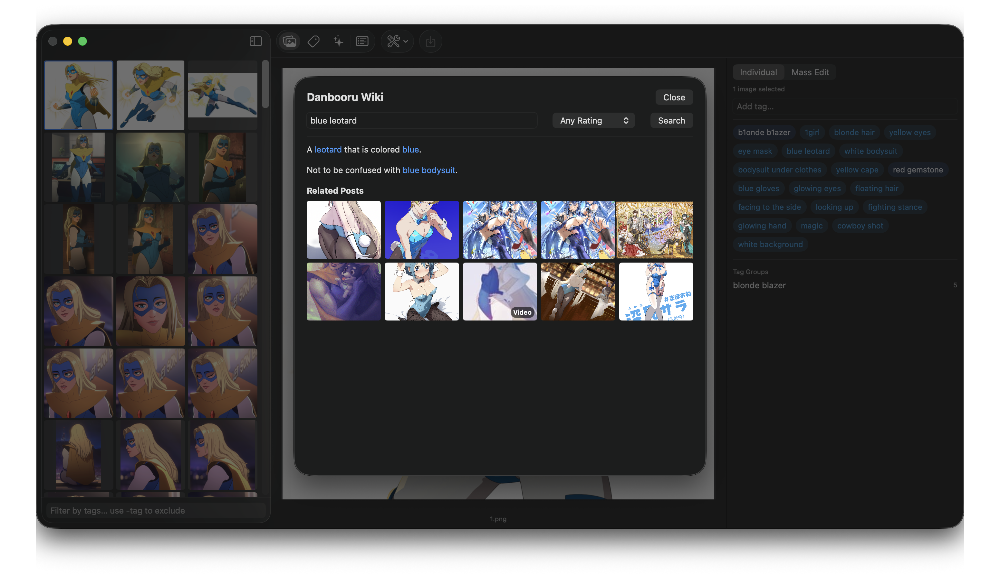
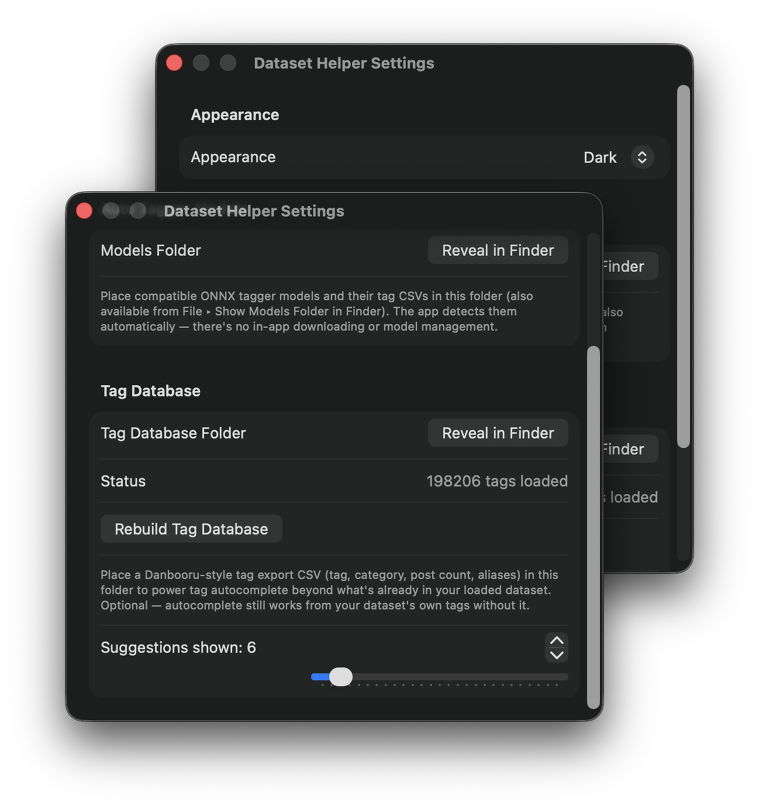

<!--
  This file is written for the PUBLIC releases repo (PotatoMerchant/dataset-helper-releases),
  not this one — that repo holds only the built .dmg + appcast.xml (see RELEASING.md), so it has
  no git checkout in this project to commit this into directly. Copy this file's contents (and
  the images/ folder) to that repo's own README.md.
-->

    

<h1 align="center">Dataset Helper</h1>

    <strong>A native macOS app for tagging and refining image datasets for LoRA / diffusion-model training</strong> 

    
    
    

    <a href="https://github.com/PotatoMerchant/dataset-helper-releases/releases/latest"><strong>Download the latest release</strong></a>

---

    <a href="#features">Features</a> &bull;
    <a href="#install">Install</a> &bull;
    <a href="#requirements">Requirements</a>

---

## What is Dataset Helper?

Dataset Helper is where you tag, clean up, and organize an image dataset before training —
Danbooru-style tagging with autocomplete, a local ONNX auto-tagger, reusable tag groups,
dataset-wide find/replace, and a few file-prep tools, all in one native app.

This started as a personal passion project — decent dataset-tagging tools on macOS are surprisingly
hard to come by, most of what's out there is  exclusively available on Windows or x64/x86 architecture, and that's a pain I can
sympathise with. I Figured I'd share this in case it's useful to anyone else in the same boat.

## Features

### Tag with color-coded autocomplete

Type into any **Add tag…** field (underscore format, e.g. `blonde_hair`) and pick from a live,
color-coded dropdown — blue for general, green for character, and so on, the same scheme
Danbooru itself uses. The filter box at the bottom of the sidebar (`-blue_leotard -red_gemstone`) narrows the image grid down to exactly the images that don't have those tags.

### Auto-tag with a local model

Point the **Auto Tagger** section (the sparkles icon in the topbar) at a ONNX model, dial in the
general/character confidence thresholds, and run it on your selection — either **Auto-Tag** to apply
results immediately, or **Preview Diff** to review each image first.

### Review suggestions before they're applied

In Preview Diff mode, suggested tags show up as a dashed tray above an image's real tags —
nothing is added until you say so. Click a suggestion to accept it, right-click to dismiss just
that one, or **Clear All** to dismiss every suggestion for that image at once.

### Reusable tag groups, colored by category

Save a set of tags you apply often — a character's standard tags, a style preset — as a named
group in the **Tag Groups** section (the tag icon), then apply the whole thing to one or many
selected images in a click from the "Tag Groups" list at the bottom of the tag editor. Each tag's
color tells you its Danbooru category at a glance: artist, copyright, character, general, meta.

### Look up a tag you don't recognize

Not sure what a tag means, or want to see example art for it before you use it? Double-click any
tag to jump straight to its wiki page and related posts, or open the search manually via
**Help ▸ Search Danbooru Wiki…** (`⌘⇧F`) — both without leaving the app.

### Configure models, tag database, and appearance

Open **Settings** (`⌘,`) to point the app at your AutoTagger models folder, import a Danbooru tag
export to power autocomplete everywhere else, and switch appearance or how many suggestions show.

Dataset Helper doesn't ship with either of these — you bring your own, dropped into the right
folder (each has a **Reveal in Finder** button right in Settings, or File ▸ Show \_\_\_ Folder in
Finder):

- **A tagger model, in the Models folder** — [WD v1.4 SwinV2 Tagger V2](https://huggingface.co/SmilingWolf/wd-v1-4-swinv2-tagger-v2)
  is a solid default; download its `.onnx` file and `selected_tags.csv` together into that folder.
- **A tag database CSV, in the Tag Database folder** — [Danbooru/e621 Autocomplete Tag Lists (incl. aliases)](https://civitai.com/models/950325/danboorue621-autocomplete-tag-lists-incl-aliases-krita-ai-support?modelVersionId=2818225)
  works well and is what powers the color-coded autocomplete shown above. This one's optional —
  autocomplete still works from your dataset's own tags without it — but it's what fills in
  suggestions for tags you haven't used yet.

### More tools

- **Mass edit** — find and replace a tag across the entire dataset, or bulk-add/remove one.
- **Dataset tools** — batch rename, crop/bucket, flatten background color, and find duplicates.

## Install

Download the `.dmg` above, open it, and drag Dataset Helper to Applications.

> This build isn't notarized by Apple, so the first launch will show an "unidentified developer"
> warning — right-click the app → **Open** → **Open** once to clear it. Every launch after that
> is normal. Updates can be checked and installed within the app.

Dataset Helper is signed with an ad-hoc signature (not an Apple Developer ID) and isn't
notarized, which is why macOS shows that warning — this is a one-person project without a paid
Developer Program membership, not a sign that anything's wrong with the build. If you'd like
extra peace of mind before opening it, you're welcome to scan the `.dmg` yourself with
[VirusTotal](https://www.virustotal.com) or another scanning service of your choice.

## Requirements

macOS 26.1 or later &bull; Apple Silicon
